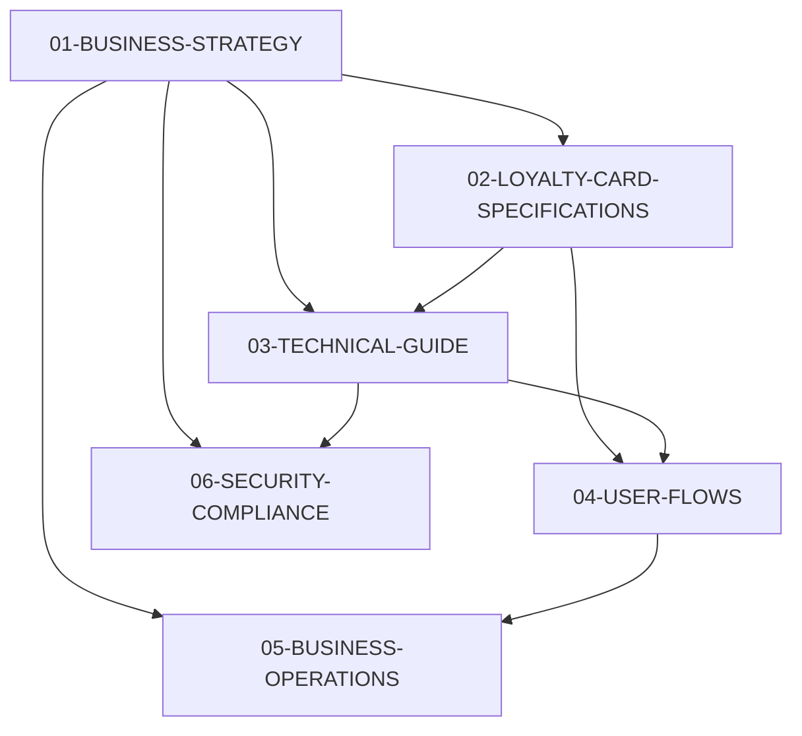

# LoyalTea Documentation Index
*Complete project documentation organized by purpose and audience*

## 📋 Documentation Structure

### 🎯 **For Project Manager**
Primary documents for business decisions and project oversight:

1. **[01-BUSINESS-STRATEGY.md](01-BUSINESS-STRATEGY.md)** - Complete business overview
   - Market analysis and competitive positioning  
   - Revenue model and pricing strategy
   - 3-month beta plan and success metrics
   - Manual billing approach and personal relationships

2. **[02-LOYALTY-CARD-SPECIFICATIONS.md](02-LOYALTY-CARD-SPECIFICATIONS.md)** - 8 card types
   - Complete specifications for all loyalty card types
   - Business use cases and customer psychology
   - Implementation examples and success metrics

### 👨‍💻 **For Developer**  
Technical implementation guides and specifications:

3. **[03-TECHNICAL-GUIDE.md](03-TECHNICAL-GUIDE.md)** - Complete dev guide
   - System architecture and technology stack
   - Database schema and API specifications
   - Development phases and timeline
   - Integration requirements (Apple/Google Wallet)

4. **[04-USER-FLOWS.md](04-USER-FLOWS.md)** - Complete user journeys
   - Detailed workflows for all 4 user types
   - QR code system and mobile interfaces
   - Transaction processing and error handling

### 🏗️ **For Implementation**
Operational procedures and setup guides:

5. **[05-BUSINESS-OPERATIONS.md](05-BUSINESS-OPERATIONS.md)** - Day-to-day operations
   - Business onboarding procedures
   - Staff training materials
   - Customer support processes
   - System maintenance procedures

6. **[06-SECURITY-COMPLIANCE.md](06-SECURITY-COMPLIANCE.md)** - Security framework
   - Data protection and privacy policies
   - Payment processing compliance
   - System security measures
   - Legal compliance requirements

---

## 📊 Document Status & Version Control

| Document | Status | Last Updated | Purpose |
|----------|--------|--------------|---------|
| 00-DOCUMENT-INDEX.md | ✅ Current | 2024-01-20 | Navigation & organization |
| 01-BUSINESS-STRATEGY.md | ✅ Current | 2024-01-20 | Authoritative business plan |
| 02-LOYALTY-CARD-SPECIFICATIONS.md | ✅ Current | 2024-01-20 | Complete card type specs |
| 03-TECHNICAL-GUIDE.md | ✅ Current | 2024-01-20 | MVP development guide |
| 04-USER-FLOWS.md | ✅ Current | 2024-01-20 | Complete user workflows |
| 05-BUSINESS-OPERATIONS.md | ✅ Current | 2024-01-20 | Operational procedures |
| 06-SECURITY-COMPLIANCE.md | ✅ Current | 2024-01-20 | Security & legal framework |

---

## 🎯 Quick Navigation by Role

### **Project Manager** - Business Planning & Strategy
- Start with: [01-BUSINESS-STRATEGY.md](01-BUSINESS-STRATEGY.md)
- Reference: [02-LOYALTY-CARD-SPECIFICATIONS.md](02-LOYALTY-CARD-SPECIFICATIONS.md)
- Operations: [05-BUSINESS-OPERATIONS.md](05-BUSINESS-OPERATIONS.md)

### **Developer** - Technical Implementation  
- Start with: [03-TECHNICAL-GUIDE.md](03-TECHNICAL-GUIDE.md)
- Reference: [04-USER-FLOWS.md](04-USER-FLOWS.md)
- Card specs: [02-LOYALTY-CARD-SPECIFICATIONS.md](02-LOYALTY-CARD-SPECIFICATIONS.md)

### **Business Owner** - Understanding the System
- Overview: [01-BUSINESS-STRATEGY.md](01-BUSINESS-STRATEGY.md) (Customer Benefits section)
- Card types: [02-LOYALTY-CARD-SPECIFICATIONS.md](02-LOYALTY-CARD-SPECIFICATIONS.md)
- Daily use: [04-USER-FLOWS.md](04-USER-FLOWS.md) (Business Owner section)

### **Compliance/Legal** - Requirements & Security
- Primary: [06-SECURITY-COMPLIANCE.md](06-SECURITY-COMPLIANCE.md)
- Business model: [01-BUSINESS-STRATEGY.md](01-BUSINESS-STRATEGY.md)

---

## 📖 Document Relationships

---

## ⚠️ Deprecated Documents

The following documents have been consolidated into the new structure:

**Archived (Do Not Use)**:
- ~~1-PM-BUSINESS-OVERVIEW.md~~ → Consolidated into 01-BUSINESS-STRATEGY.md
- ~~BUSINESS-MVP-OVERVIEW.md~~ → Consolidated into 01-BUSINESS-STRATEGY.md  
- ~~REFINED-BUSINESS-OVERVIEW.md~~ → Consolidated into 01-BUSINESS-STRATEGY.md
- ~~3-USER-FLOWS.md~~ → Consolidated into 04-USER-FLOWS.md
- ~~SIMPLE-USER-FLOWS.md~~ → Consolidated into 04-USER-FLOWS.md
- ~~UPDATED-USER-FLOWS.md~~ → Consolidated into 04-USER-FLOWS.md
- ~~DEV-COMPLETE-GUIDE.md~~ → Consolidated into 03-TECHNICAL-GUIDE.md
- ~~DEV-MVP-GUIDE.md~~ → Consolidated into 03-TECHNICAL-GUIDE.md
- ~~4-PRICING-ANALYSIS.md~~ → Market analysis moved to 01-BUSINESS-STRATEGY.md
- ~~2-SITEMAPS.md~~ → Site structure moved to 03-TECHNICAL-GUIDE.md

**Keep for Reference**:
- ✅ **LOYALTY-CARD-SPECIFICATIONS.md** → Now 02-LOYALTY-CARD-SPECIFICATIONS.md (unchanged)
- ✅ **jlaunch-info.md** → jBoilerplate reference (unrelated to LoyalTea)

---

## 🔄 Update Process

**When updating documents:**
1. Update the primary document
2. Cross-reference related documents for consistency
3. Update the "Last Updated" date in this index
4. Ensure no contradictions with other documents

**Critical Consistency Points:**
- Pricing: RM99/month single plan (no tiers in MVP)
- Card types: Exactly 8 types as specified
- User roles: Super Admin, Business Owner, Staff, Customer (4 roles)
- Technology: jBoilerplate (Vue 3 + TypeScript + Shadcn UI)
- Approach: Manual billing, wallet-first, mobile-optimized

---

**This index ensures all project stakeholders can quickly find the right documentation for their needs while maintaining consistency across all documents.**